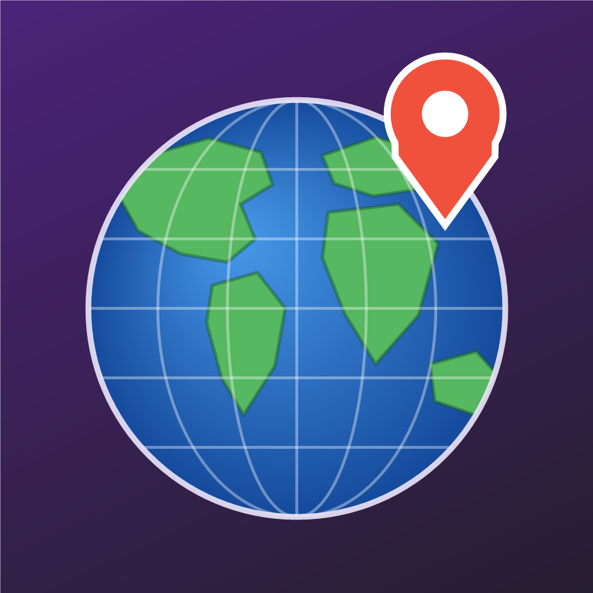

# Fav Places App

<p align="center">
  
</p>

A Flutter app ("Great Places") for saving your favorite places. Each place has a
title, a photo (taken with the camera or picked from the gallery), and a location
(your current GPS position or a point picked on a map). Places are persisted
locally in an SQLite database, so they survive app restarts.

Built as part of a Flutter course, the app demonstrates native device features:
camera, GPS location, maps, file storage, and on-device SQL.

## Features

- **Places list** — all saved places, loaded from SQLite on startup.
- **Add a place** — title text field, image input, and location input; the
  *Add Place* button stays disabled until all three are provided.
- **Take or pick a photo** — bottom sheet to choose between camera and gallery
  (`image_picker`); the image is copied into the app documents directory so it
  persists.
- **Get location** — either the device's current GPS position (`location`
  package, with service/permission handling) or a point tapped on an
  interactive OpenStreetMap map (`flutter_map`).
- **Reverse geocoding** — coordinates are turned into a human-readable address
  via the free [Nominatim](https://nominatim.openstreetmap.org) API, falling
  back to raw coordinates if the request fails.
- **Place details** — full-screen photo with a circular map preview and the
  address; tapping the preview opens a read-only map centered on the place.
- **Swipe to delete** — swipe a place from right to left (`Dismissible`) to
  remove it; the row is deleted from the SQLite database and the stored photo
  copy is cleaned up from the app documents directory.
- **Persistence** — places are stored in a `places.db` SQLite database
  (`sqflite`) in a `user_places` table (id, name, image path, latitude,
  longitude, address).
- **Dark purple theme** — `ColorScheme.fromSeed` with the Ubuntu Condensed font
  (`google_fonts`).

## Project structure

```
lib/
├── main.dart                        # App entry point, theme, MaterialApp
└── models/
    ├── place.dart                   # Place & PlaceLocation models (uuid ids)
    ├── screens/
    │   ├── places_list.dart         # Home screen + SQLite read/write
    │   ├── add_place.dart           # Form: title, image, location
    │   ├── places_details.dart      # Photo + map preview + address
    │   └── map.dart                 # Interactive map (pick / view location)
    └── widgets/
        ├── places_list.dart         # ListView of saved places
        ├── image_input.dart         # Camera/gallery picker widget
        ├── location_input.dart      # GPS / map picker + reverse geocoding
        ├── map_preview.dart         # Small static map preview
        └── map_layers.dart          # Shared OSM tile layer + marker helpers
assets/icon/app_icon.png             # Launcher icon source (world map globe)
scripts/generate_app_icon.ps1        # Regenerates the launcher icon image
```

## Dependencies

| Package | Purpose |
|---|---|
| `google_fonts` | Ubuntu Condensed text theme |
| `uuid` | Unique ids for places |
| `image_picker` | Camera / gallery photo capture |
| `location` | GPS position + permission handling |
| `flutter_map` + `latlong2` | OpenStreetMap map display and picking |
| `http` | Nominatim reverse-geocoding requests |
| `path` + `path_provider` | Copying images into app documents directory |
| `sqflite` | Local SQLite persistence |
| `flutter_launcher_icons` (dev) | Generates Android/iOS launcher icons |

No API keys are required — maps and geocoding use free OpenStreetMap services.

## Getting started

Requires the Flutter SDK (Dart `^3.12.1`).

```sh
flutter pub get
flutter run
```

The app targets **Android and iOS** (camera, GPS, and SQLite are
mobile-focused). Required permissions are already declared:

- **Android** — `INTERNET` in `AndroidManifest.xml`; camera and location
  permissions are injected by the `image_picker` and `location` plugins.
- **iOS** — `NSCameraUsageDescription`, `NSPhotoLibraryUsageDescription`, and
  `NSLocationWhenInUseUsageDescription` in `ios/Runner/Info.plist`.

## App icon

The launcher icon is a stylized world-map globe with a location pin, generated
programmatically and applied to **Android and iOS only** via
[`flutter_launcher_icons`](https://pub.dev/packages/flutter_launcher_icons)
(configured in `pubspec.yaml`, including Android adaptive icons).

To change it:

```sh
# 1. Regenerate the source image (or replace assets/icon/app_icon.png)
powershell -File scripts\generate_app_icon.ps1

# 2. Re-apply the launcher icons
dart run flutter_launcher_icons
```
